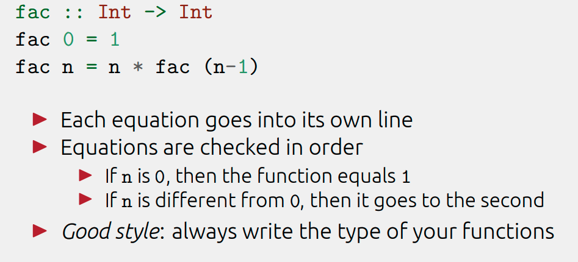

#### How to install Haskell on  macOS
 - [Install Haskell on macOS](https://medium.com/analytics-vidhya/install-haskell-on-macos-e5677ab620b5)
  
 
 <pre>
    Some distinguishing features of Functional Programming?:
    
    1. Recursion instead of iteration.
    2. Pattern matching on values.
    3. Expressions instead of statements.
    4. Functions as first-class citizens.
    
    ▶ You can write “functional code” in almost any language.
    
    Haskell can be defined with four adjectives.
    
     ▶ Functional
     ▶ Statically typed
     ▶ Pure
     ▶ Lazy
     
     What is a statically typed?
     A language is statically typed if the type of a variable is known at compile time.
     
     ▶ Every expression and function has a type.
     ▶ The compiler prevents wrong combinations.
     ▶ Haskell forbids executing code with type errors
 </pre>
 
  
<pre>
   ▶  Haskell scripts usually have a `.hs` suffix on their filename to differentiate them from other kinds of files. 
   ▶  In Haskell, we do not have a return statement, the last expression that evaluated is  what we return.
   ▶  Every value in haskell has a type.
   ▶  Variables do not change, only give names.
   ▶  Function has its own type.
   ▶  let binding, when we bind the result of some expression to a name and produce a result.
   ▶  There is no loop in haskell instead  recursion.
   ▶ In haskell variable names must start with a lowercase letter. Anything that is uppercase is interpreted by the compiler as a Data Constructor.
   
   
  ▶  " -> " is the parameter that a function takes and the thing after it is what it returns.
  
  ▶ A pattern like `x:xs` will bind the head of the list to `x` and the rest of it to `xs`, even 
  if there's only one  element so xs ends up being an empty list.
  
  ▶ `x:y:z:zs` bind the first three elements to variables and the rest of the list to another variable,

e.g
` tell [] = "The list is empty"  
  tell (x:[]) = "The list has one element: " ++ show x  
  tell (x:y:[]) = "The list has two elements: " ++ show x ++ " and " ++ show y  
  tell (x:y:_) = "it matches any list of length 2 or more. The first two elements are: " ++ show x ++ " and " ++ show y  
`

   

 Basic types:
  • Integers
     3 + 4 * 5 :: Integer
 • Floats
    3 + 4.5 * 5.5 :: Float
 • Characters
    ‘a’ :: Char
</pre>
 

---
<pre>
 List can be of one type.
 
 Primitives for building lists
   ▶ [] :: [a] is the empty list
   ▶ (:) :: a -> [a] -> [a] (the “cons” operator)
   ▶ Build a list by putting an element at the front
   ▶ When we write [1, 2, 3] the compiler translates it to
          1 : 2 : 3 : []
 
> init [1,2,3,4]
   ▶ which give you a copy of that list where the last element removed.
  
> [1 .. 10] creates a list from 1 to 10

   ▶ null tells whether a list is empty
   ▶ head returns the first element in a list
   ▶ tail returns all but the first element removed
   > null [1,2,3]
   False
   > head [1,2,3]
   1
   > tail [1,2,3]
   [2,3]

commonly used library functions on lists are illustrated below.
Select the first element of a non-empty list:
    > head [1,2,3,4,5]
    1
    Remove the first element from a non-empty list:
    > tail [1,2,3,4,5]
    [2,3,4,5]
    Select the nth element of list (counting from zero):
    > [1,2,3,4,5] !! 2
    3
    Select the first n elements of a list:
    > take 3 [1,2,3,4,5]
    [1,2,3]
    Remove the first n elements from a list:
    > drop 3 [1,2,3,4,5]
    [4,5]
    Calculate the length of a list:
    > length [1,2,3,4,5]
    5
    Calculate the sum of a list of numbers:
    > sum [1,2,3,4,5]
    15
    Calculate the product of a list of numbers:
    > product [1,2,3,4,5]
    120
    Append two lists:
    > [1,2,3] ++ [4,5]
    [1,2,3,4,5]
    Reverse a list:
    > reverse [1,2,3,4,5]
    [5,4,3,2,1] 
</pre>
 - Delete the first N elements from a list.
     `drop n xs`
  - `init xs` removes just the last element.
  - Make a new list containing just the first N elements from an existing list.
     `take n xs`
  - Split a list into two smaller lists (at the Nth position).
     `splitAt n xs`
     
     
  - `Integral` includes only integral (whole) numbers. In this typeclass are Int and Integer.
  - `fromIntegral` useful when you want integral and floating point types to work togethe , if we try to get a length of a list and then add it to 3.2, we'll get an error because we tried to add together an Int and a floating point number. So to get around this, we do fromIntegral (length [1,2,3,4]) + 3.2 and it all works out.

---
 

- “ A function is a mapping from arguments of one type to results of another type. ”

In Haskell, a function is a mapping that takes one or more arguments and produces a single result, and is defined using an equation that gives a name for the function, a name for each of its arguments, and a body that specifies how the result can be calculated in terms of the arguments.

<h4> The names of the function and its arguments must begin with a lower-case letter, but can then be followed by zero or more letters (both lower- and upper-case), digits, underscores, and forward single quotes. </h4>

Excerpt From: Hutton, Graham. “Programming in Haskell (9781316876152).” Apple Books. 
For example, 
a function double that takes a number x as its argument, and produces the result x + x, can be defined by the following equation:
  
 ### `double x = x + x`
<ol>
  <li> A function double that takes a number x as its argument</li>
  <li> Produces the result x + x </li>
 <li> When a function is applied to actual arguments, the result is obtained by substituting these arguments into the body of the function in place of the argument names. </li>
<li> There is no restrictions on the types of the arguments  and results of a function</li>
</ol>

 
 

#### ` T1 -> T2 for the type of all functions that map arguments of type T1 to results of type T2.`

Excerpt From: Hutton, Graham. “Programming in Haskell (9781316876152).” Apple Books. 

#####  “every function has a type that specifies the nature of its arguments and results, which is automatically inferred from the definition of the function”

  
 ---
  
 |  |

---
### Conditionals
<pre>
  if<Condition> then <True-Value>else <False-Value> 

-- if condition then expression else expression.

 ▶ condition must be a Bool expression.
 ▶ You always need both branches.
 ▶ What would you return if one is missing?.
 ▶ Remember, everything is an expression.

  `pushOut x = if x == 0
               then x
               else
               if x > 0
               then x + 1
              else x - 1`

 </pre>
 
---
### Guards
<pre>

   - Instead of conditionals,we use equations with guards.
   ▶ The symbol | is read as such that.
   ▶ Otherwise is just a constant wich is always evaluates to true (always taken).
   ▶ Ending a sequence of guards with otherwise is not necessary, but provides a convenient way of handling all other cases.
   ▶ Each guard defines a condition over the arguments
   ▶ These conditions are checked in order
   ▶ The first satisfiable one is applied
   ▶ We typically use otherwise for the default case
   abs n | n < 0 = -n
   | otherwise = n
</pre>

   #### Q)
     <pre>
     Write a function named $range$ (with type $Int -> Int -> [Int]$) that takes
      two integers and creates a list containing all integers between the two given
      integers. The list's head is the first given integer, and the list's last element
      is the second given integer.
      e.g. $range 4 9$ returns $[4,5,6,7,8,9]$
      e.g. $range 9 4$ returns $[9,8,7,6,5,4]$
      e.g. $range 4 4$ returns $[4]$
      </pre>

#### A)
        <pre>
           range  x y | x < y   = [x..y]  
           | x== y    = [x]
           |otherwise =[x,x-1..y] 
        </pre>

 
 ---
 
 ### List comprehensions
  <pre>
  [ expr | x <- list ]
  
  Succint notation for building new lists from old ones
  addone :: Num a => [a] -> [a]
  addone xs = [x + 1 | x <- xs]
  
  ▶ “For each x in xs, return x + 1”
  ▶ Very similar to mathematical notation
  {x + 1 | x ∈ xs}
</pre>

---
### higher-order function
<pre>
 > map fact [1 .. 5]
       [1,2,6,24,120]
</pre>

##### Lambdas
Lambdas are basically anonymous functions that are used because we need some functions only once.
To make a lambda, we write a `\` (because it kind of looks like the greek letter lambda if you squint hard enough) and then we write the parameters, separated by spaces. After that comes a -> and then the function body.

<pre>
     Write a function named $percent$ (with type $Int -> Int -> Float$) that
     takes two integers $m$ and $n$ and returns the percentage of $m/n$.
     e.g. $percent 3 4$ returns $75.0$
     
     A)
     
     percent = \ m -> \ n -> ((fromIntegral m)/(fromIntegral n) * 100.0)
</pre>

  

[splitAt](http://zvon.org/other/haskell/Outputprelude/splitAt_f.html) | [take](https://github.com/Hsabonchi/Haskell/edit/main/Functions.md)

Credit to Hutton, Graham. “Programming in Haskell (9781316876152).” Apple Books. 
