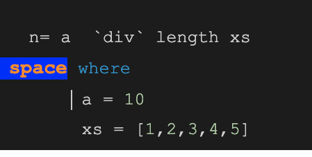

#### How to install Haskell on  macOS
 - [Install Haskell on macOS](https://medium.com/analytics-vidhya/install-haskell-on-macos-e5677ab620b5)
  
 
  Haskell scripts usually have a .hs suffix on their filename </strong> to differentiate them from other kinds of files. 

---
<pre>
commonly used library functions on lists are illustrated below.
Select the first element of a non-empty list:
> head [1,2,3,4,5]
1
Remove the first element from a non-empty list:
> tail [1,2,3,4,5]
[2,3,4,5]
Select the nth element of list (counting from zero):
> [1,2,3,4,5] !! 2
3
Select the first n elements of a list:
> take 3 [1,2,3,4,5]
[1,2,3]
Remove the first n elements from a list:
> drop 3 [1,2,3,4,5]
[4,5]
Calculate the length of a list:
> length [1,2,3,4,5]
5
Calculate the sum of a list of numbers:
> sum [1,2,3,4,5]
15
Calculate the product of a list of numbers:
> product [1,2,3,4,5]
120
Append two lists:
> [1,2,3] ++ [4,5]
[1,2,3,4,5]
Reverse a list:
> reverse [1,2,3,4,5]
[5,4,3,2,1] 
</pre>

---

- <strong>In haskell variable names must start with a lowercase letter. Anything that is uppercase is interpreted by the compiler as a Data Constructor</strong> 
 
 

- “ A function is a mapping from arguments of one type to results of another type. ”

In Haskell, a function is a mapping that takes one or more arguments and produces a single result, and is defined using an equation that gives a name for the function, a name for each of its arguments, and a body that specifies how the result can be calculated in terms of the arguments.

<h4> The names of the function and its arguments must begin with a lower-case letter, but can then be followed by zero or more letters (both lower- and upper-case), digits, underscores, and forward single quotes. </h4>

Excerpt From: Hutton, Graham. “Programming in Haskell (9781316876152).” Apple Books. 
For example, 
a function double that takes a number x as its argument, and produces the result x + x, can be defined by the following equation:
  
 ### `double x = x + x`
<ol>
  <li> A function double that takes a number x as its argument</li>
  <li> Produces the result x + x </li>
 <li> When a function is applied to actual arguments, the result is obtained by substituting these arguments into the body of the function in place of the argument names. </li>
<li> There is no restrictions on the types of the arguments  and results of a function</li>
</ol>

 
 

#### ` T1 -> T2 for the type of all functions that map arguments of type T1 to results of type T2.`

Excerpt From: Hutton, Graham. “Programming in Haskell (9781316876152).” Apple Books. 

#####  “every function has a type that specifies the nature of its arguments and results, which is automatically inferred from the definition of the function”

  
 ---
  
  
 

Excerpt From: Hutton, Graham. “Programming in Haskell (9781316876152).” Apple Books. 
