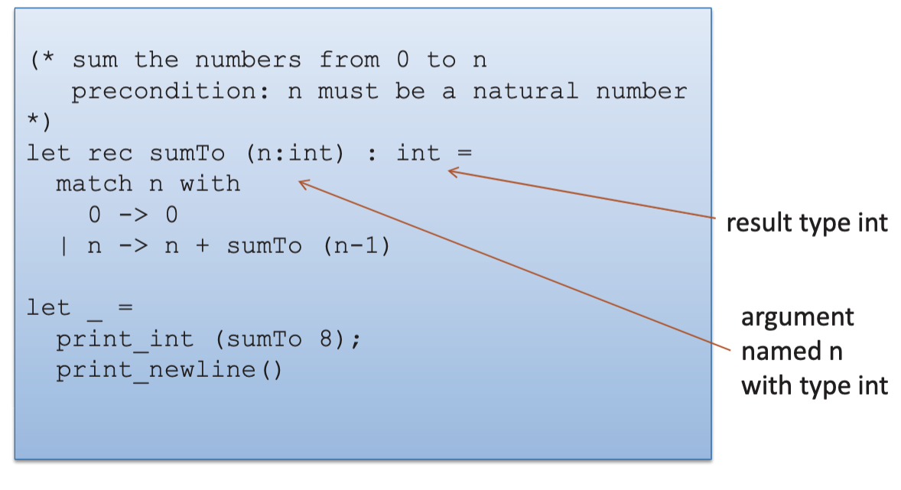

 
  
 
<ul>
<li> a comment(* ... *)</li> 
<li> The keyword “let” begins a definition</li> 
<li> keyword “rec” indicates recursion </li>    
<li> keyWords “match” and “with” is to deconstruct the value n using pattern matching </li>    
<li> vertical bar "|" separates the alternative patterns</li>    
<li> "let _ is" an anonymous defination like the main function for c </li> 
<li> <pre> if (n==0) return 0 
           else 
             return n+(sumTo(n-1))
   </pre>
  </li> 
 <li> <pre> java:
            - loop
            - if
            
          Ocaml:
            - recursive function calls "rec"
            - pattren matching  math n with ....
             
   </pre>
  </li> 
</ul>
