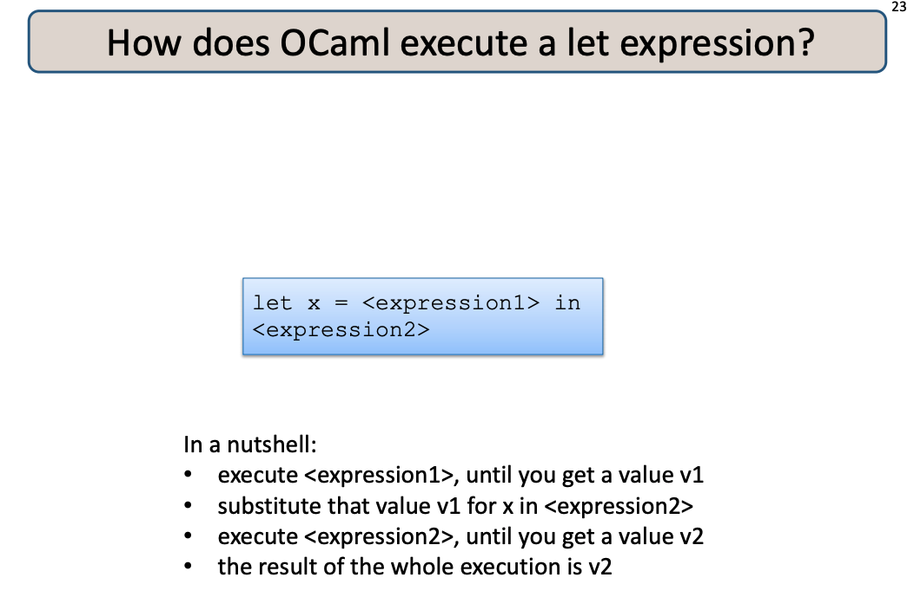

 

  
 

---

<pre>

let bool_to_int (b:bool) : int =
  match b with
      true  -> 1
    | false -> 0

(* (first name, last name, age) *)
type info = string * string * int
let name_and_age1 : info = ("David", "Walker", 25)
let name_and_age2 : info = ("Brian", "Kernighan", 15)

let full_name ((first, last, _) : info) : string = first ^ " " ^ last

let or_pair (p:bool*bool) : bool = 
  match p with
    | (true,true) -> true
    | (true,false) -> true
    | (false,true) -> true
    | (false,false) -> false

(* count occurrences of true *)
let count5 (p:bool*bool*bool*bool*bool) : int = 
  let (b1, b2, b3, b4, b5) = p in
  bool_to_int b1 + 
    bool_to_int b2 + 
    bool_to_int b3 + 
    bool_to_int b4 + 
    bool_to_int b5
    
 </pre>

