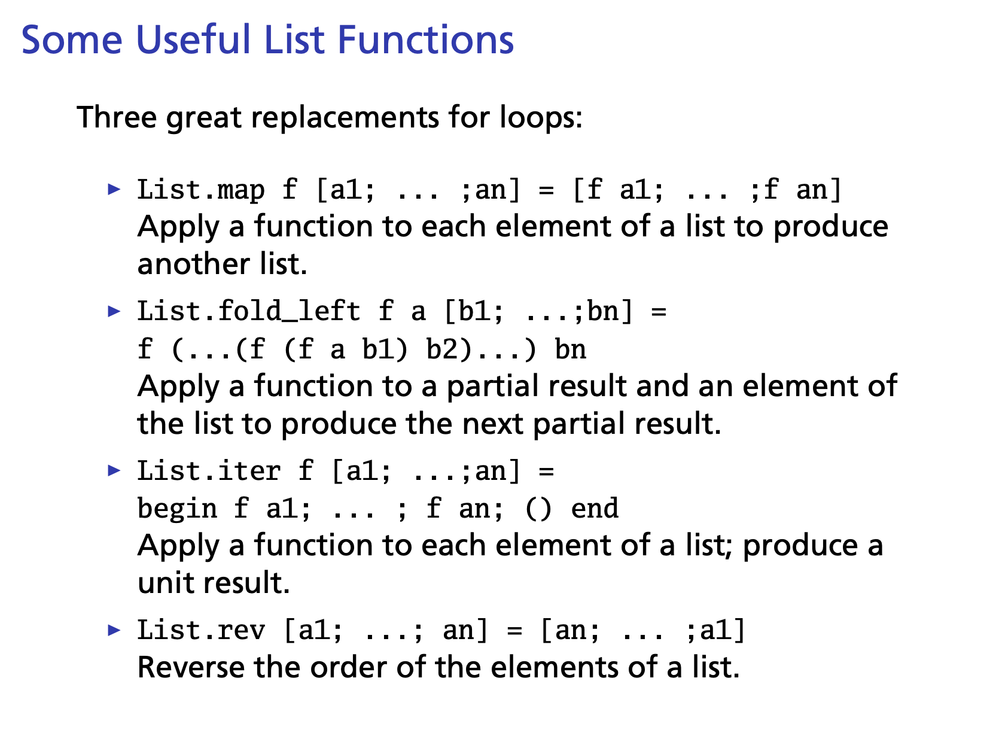
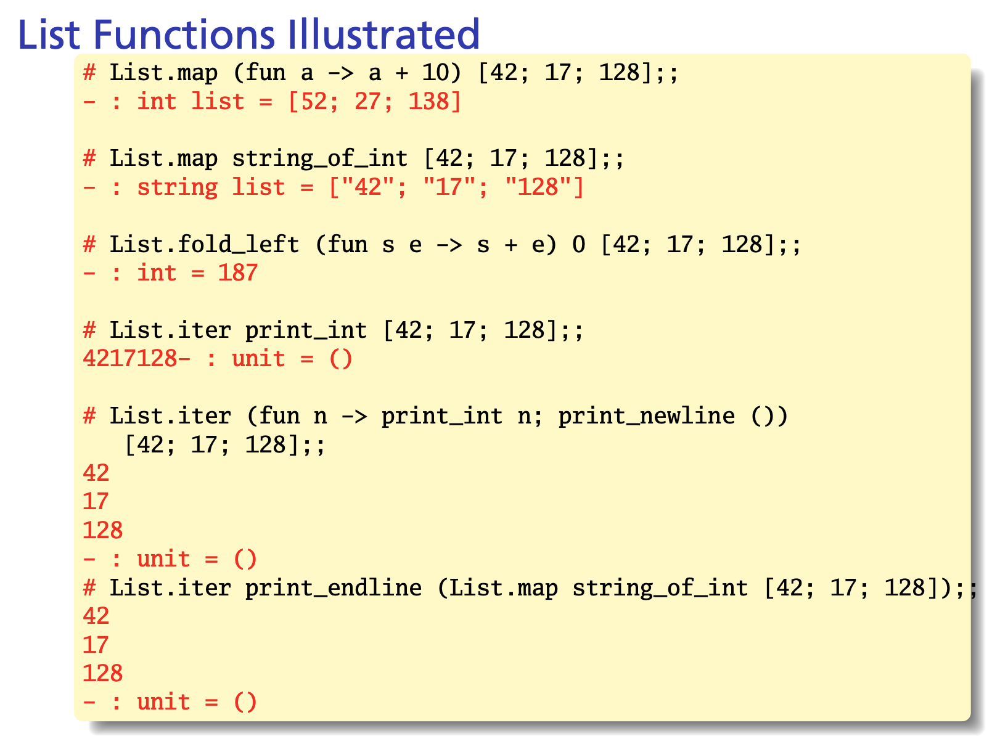
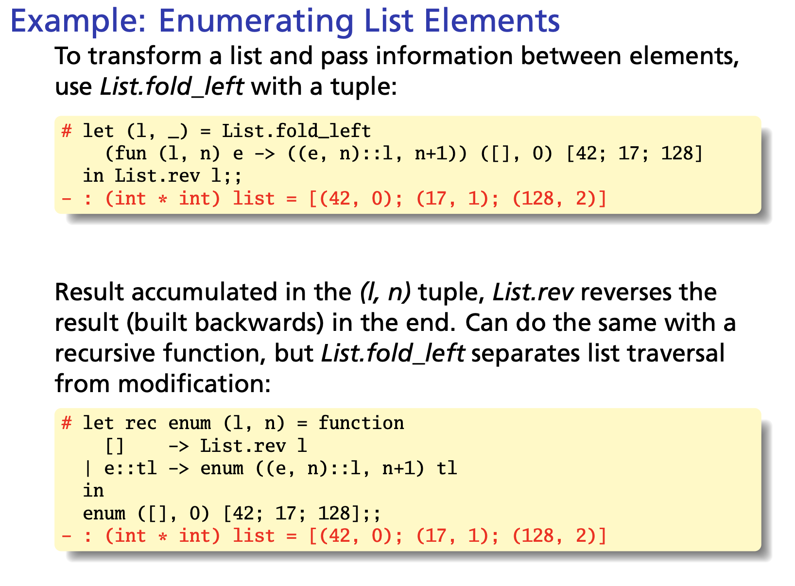
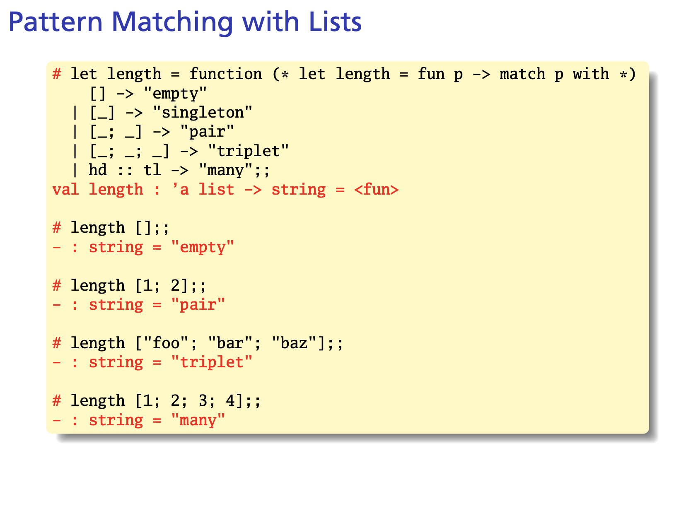

[List_Tutorial](https://www.cs.umd.edu/class/fall2020/cmsc330/lectures/08-ocaml-lists-polymorphic-types.pdf)

 
 

  <pre> let rec sum lst = 
    match lst with
    | [] -> 0
    | h::t -> h + sum t
    
    This function says to take the input lst and see whether it has the same shape as the empty list.
    If so, return 0. Otherwise, if it has the same shape as the list h::t, 
    then let h be the first element of lst, and let t be the rest of the elements of lst,
    and return h + sum t. The choice of variable names here is meant to
    suggest "head" and "tail" and is a common idiom,
    
 </pre>
    

   
    
    
